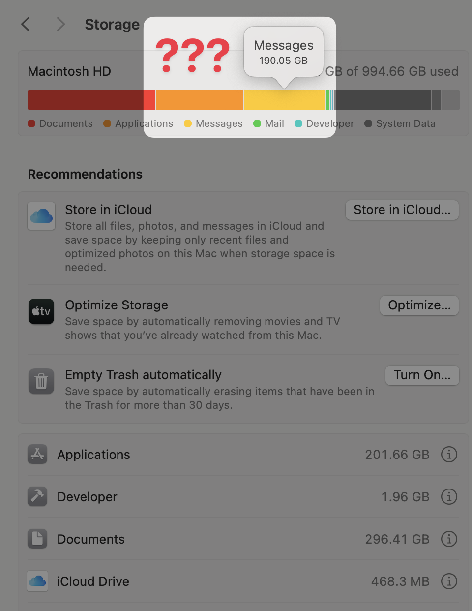

# Messages Storage Saver for Mac

**Free up the space iMessage attachments take on your Mac, without deleting anything from iCloud, your iPhone, or your conversations.**

[](https://github.com/zmh/messages-storage-saver-mac/releases/latest)
[](#requirements)
[](LICENSE)

<p align="center">
  
</p>

Is Messages taking up 50, 100, 200 GB of storage on your Mac? System Settings › Storage lists "Messages" as one of the biggest items, and there is nothing you can do about it. Photos has "Optimize Mac Storage"; Messages doesn't. Every photo and video anyone ever sent you is stored twice: once in iCloud and once on your Mac, forever.

Messages Storage Saver is the missing switch. You choose how old and how large an attachment has to be ("larger than 100 MB and older than 2 years"), it shows you how much space that frees, and it removes only the local copies of attachments that are already in iCloud. Messages keeps working: an attachment you've cleared shows a download button and comes back from iCloud when you open it. Nothing is deleted from iCloud, from your other devices, or from a conversation.

- Native Mac app, open source, no network access, no analytics.
- Needs Messages in iCloud. Works on macOS 14 Sonoma and macOS 15 Sequoia, Apple silicon and Intel.
- A live table shows what every choice (1 month to 10 years, any size to 500 MB) would free right now.

## Download

1. **[Download the latest release](https://github.com/zmh/messages-storage-saver-mac/releases/latest)**, open the `.dmg`, and drag **Messages Storage Saver** to Applications.
2. Launch it from Spotlight. Releases are signed and notarized by Apple, so it opens like any other app.
3. Grant **Full Disk Access** when the app asks (System Settings › Privacy & Security › Full Disk Access › add Messages Storage Saver), then click **Relaunch app**. The app needs it to read the Messages database.
4. Choose how old and how large you want to clear, click **Optimize Now…**, read the preview, confirm. Then quit and reopen Messages so it shows download buttons instead of old thumbnails.

Or build it from source (below).

## Requirements

- macOS 14 or newer.
- **Messages in iCloud turned on** (Messages › Settings › iMessage › Enable Messages in iCloud). The app waits until Messages has finished uploading everything. If Messages is behind, the app's **Sync now** button presses Messages' own Sync Now for you (this needs the Accessibility permission, once).

## How it works

### The problem

With Messages in iCloud, Apple keeps the master copy of every attachment in iCloud. Your Mac downloads each one and never lets go, even a video someone sent in 2017. iPhones quietly clear old attachments when they run low on space. The Messages app on the Mac has the same code inside it, but it's switched off (this project checked), so the local copies pile up forever. Apple's own options, **"Keep messages: 30 days / 1 year"** and **"Disable & Delete"**, are worse than the problem: they delete your conversations from iCloud and every device.

### What the app does instead

1. **Reads the Messages database, read-only**, and finds attachments Messages itself has marked as fully uploaded to iCloud. It uses Apple's own checks for this (the same ones the Mac's switched-off code uses): synced to iCloud, transfer complete, an iCloud record id present, not hidden, not a sticker, not an audio message, not a group photo, not an app payload.
2. **Applies your choice**: older than N and larger than N, never a pinned conversation, never a file changed in the last 24 hours, only files whose size on disk matches what the database says.
3. **Shows you a preview** of exactly which files in which conversations, and how much space that frees.
4. **Removes only the local file** with the normal Unix `unlink` call, after checking the database row one more time and writing a journal entry first.
5. **Messages does the rest, on its own.** When Messages sees a row whose file is gone but which still has an iCloud record, it shows the attachment as downloadable (the same placeholder iPhones show) and fetches it from iCloud when you click. The app doesn't call any Messages API for this. None exists for third parties, and none is needed.

### Everything it calls

There is no private "offload" or "mark purgeable" call anywhere in the app. This is the complete list (it's also in the app's Help pane):

| | What | How |
|---|---|---|
| Reads | `~/Library/Messages/chat.db` | SQLite opened read-only (`mode=ro`, `PRAGMA query_only`, and a guard that refuses anything but SELECT). Tables: `attachment`, `message` (dates and the audio flag only, never message text), `chat`, the two join tables, and the row counts of the two deletion-tombstone tables. |
| Reads | candidate files | `lstat`: a regular file, really inside `Attachments`, the right size, old enough. |
| Reads | Messages preferences | `CFPreferencesCopyAppValue` for `com.apple.madrid` (is Messages in iCloud on, when it last synced, is the first download done) and `com.apple.iChat` (`KeepMessageForDays`, to warn you). |
| Writes | the files you chose | `unlink` under `~/Library/Messages/Attachments`; thumbnails under `Caches/Previews` only if you tick that box. Nothing else under `~/Library/Messages`, ever. |
| Writes | its own notes | `~/Library/Application Support/MessagesStorageSaver/`: `config.json`, `journal.jsonl`, `baseline.json`, `run.lock`. |
| On your click | Relaunch Messages | `NSRunningApplication.terminate()` (a normal Quit) and `NSWorkspace` open. |
| On your click | Sync now | The Accessibility API presses Messages › Settings › iMessage › **Sync Now**, the same as you would. |
| Optional | Start at login, notifications | `SMAppService`, `UNUserNotificationCenter` (local only). |
| Never | | Network, iCloud, writing any Apple preference, restarting anything, `chflags`/`xattr`/APFS purgeable flags, deleting a message or a conversation. |

### Why it can't delete from iCloud

Messages in iCloud spreads a deletion to your other devices through "tombstone" tables in the database that only Messages' own database triggers write, and only when a row is deleted. Removing a file writes nothing to the database, and the app's database connection can't write at all. The app also records the tombstone counters before, during and after every run; if they ever grow during a run, it stops and turns automatic runs off until you look. Details in [SAFETY.md](SAFETY.md).

### Getting an attachment back

Quit and reopen Messages, open the conversation, click the download button on the attachment. It comes back from iCloud, identical to the original. Once you've downloaded something again, the app never touches it again.

## Features

- **Your choice**: "Optimize attachments larger than [any size, 1 MB, 5 MB, 10 MB, 100 MB, 500 MB] and older than [1 week … 10 years]", with a live table of what every combination would free right now.
- **Pinned conversations** the app never touches.
- **Optimize Now…** with a preview, a per-run limit, and a confirm button that says the exact number of files and size.
- **Optimize automatically** (off by default): every 6 hours after a health check, at most 25 GB per run. Only then does the app stay in the menu bar, and it can start at login if you want.
- **Health**: what's been removed, what Messages downloaded again, whether all checks pass, run history.
- **Help**: what it does and never does, and the call list above.
- Off by default: automatic runs, start at login. It's built to be opened a few times a year when the disk fills up. Closing the window quits it.

## Questions

**Does this delete my messages or attachments?** No. It removes local copies of attachments that are already in iCloud. Your messages, conversations and iCloud are untouched, and the app has no way to delete a database row.

**Will attachments disappear from my iPhone or iPad?** No. Other devices sync from iCloud, which doesn't change.

**How is this different from Messages › Settings › "Keep messages: 30 days"?** That setting deletes conversations, attachments included, from iCloud and every device. This app deletes nothing; it only frees space on this Mac.

**Why does it need Full Disk Access?** `~/Library/Messages` is protected; nothing can read the Messages database without it. The app only reads it.

**Why does "Sync now" ask for Accessibility?** Messages only accepts sync requests from Messages itself, so the button presses Messages' own Sync Now for you. It's optional; you can click that button in Messages yourself.

**I freed 15 GB but Finder shows less.** macOS gives the space back from its local snapshots over time; `tmutil listlocalsnapshots /` shows them.

**Is it safe on a huge library?** The first run is capped at 1 GB, later runs at 25 GB, every run is previewed first, and it was tested on a 190 GB library, including downloading files back. The one thing no tool can check is that Apple's servers still hold every file; the app trusts Messages' own "uploaded" flag, the same flag Apple's code trusts.

## Build from source

```sh
git clone https://github.com/zmh/messages-storage-saver-mac.git
cd messages-storage-saver-mac
swift build -c release            # core library, `mss` command line, app binary
swift test                        # 67 tests against a synthetic store, never your real one
scripts/build-app.sh --install    # dist/Messages Storage Saver.app, copied to /Applications
```

Signing: set `APP_SIGN_IDENTITY="Developer ID Application: …"` (or put it in `scripts/signing.local.sh`, which git ignores); without it the build is ad-hoc signed and Full Disk Access has to be granted again after each rebuild. `scripts/make-pkg.sh` notarizes and wraps the app in a `.dmg` (or a `.pkg` when a Developer ID Installer certificate is present).

Debug builds refuse the real Messages store; point them at a synthetic one:

```sh
python3 scripts/make-fixture.py /tmp/mss-fixture
scripts/build-app.sh --debug
open --env MSS_APP_STORE_DIR=/tmp/mss-fixture "dist/Messages Storage Saver.app"
```

## Command line

The same engine as `mss`, for scripting and looking under the hood:

```sh
.build/release/mss analyze            # what's local, what's eligible, what would be cleared (read-only)
.build/release/mss estimate           # the savings table for every age × size (read-only)
.build/release/mss probe              # the checks (read-only)
.build/release/mss chats              # conversations ranked by old attachment size (read-only)
.build/release/mss offload            # DRY RUN: nothing is removed
.build/release/mss offload --yes      # removes local copies within the run limit
.build/release/mss status             # what was removed, what Messages downloaded again, checks
.build/release/mss sync-now --yes     # press Messages' Sync Now for you (needs Accessibility)
```

Options: `--keep-days`, `--min-size-mb`, `--pin "Name"`, `--limit-gb`, `--chat`, `--before`, `--archive-to DIR` (a verified copy before removal, command line only). Settings are shared with the app in `~/Library/Application Support/MessagesStorageSaver/config.json`.

## Safety and privacy

- [SAFETY.md](SAFETY.md): the protection layers, the canaries, the limits, and the extra gates for automatic runs.
- [PRIVACY.md](PRIVACY.md): exactly what is read and written. Nothing leaves your Mac.
- [experiments/EXPERIMENT.md](experiments/EXPERIMENT.md): the test on a real account, including the finding that Apple's built-in offload is switched off on macOS 15.

## Never do these (they delete from iCloud and every device)

- Messages › Settings › General › **Keep messages: 30 Days / One Year**
- iCloud settings › Messages › **Disable & Delete**
- Deleting messages inside the Messages app while Messages in iCloud is on
- Editing `chat.db` or touching `~/Library/Messages/Sync`

## License

MIT. Not affiliated with or endorsed by Apple. "Messages", "iMessage", "iCloud" and "macOS" are trademarks of Apple Inc.
